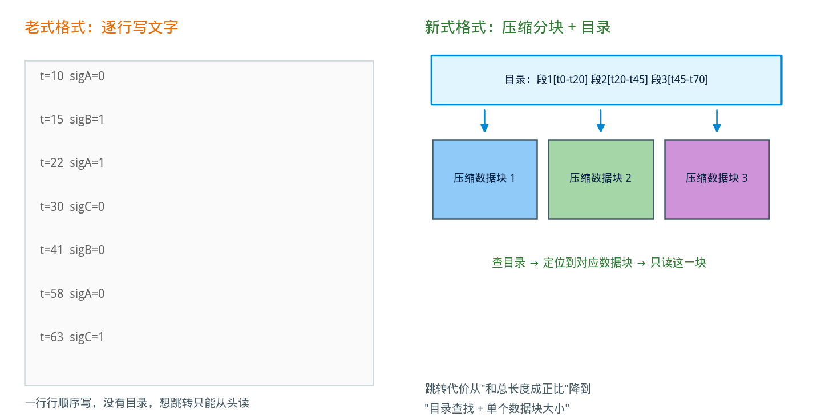
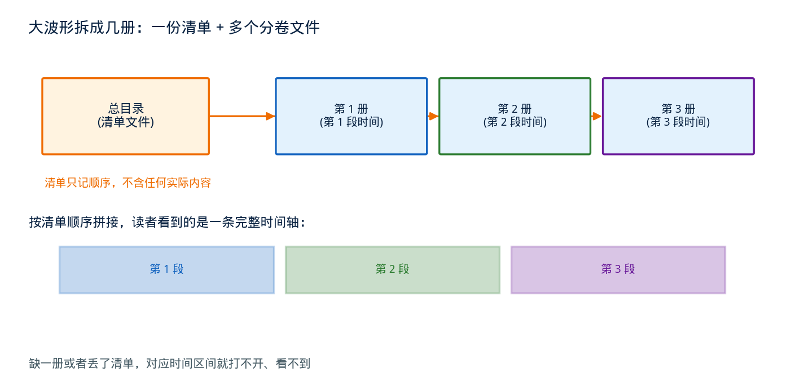
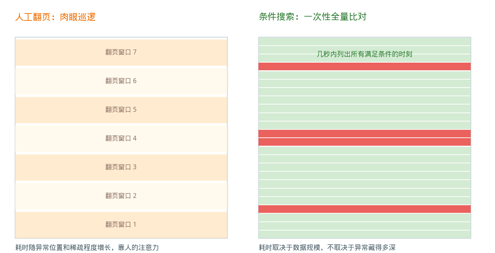

## 一份波形文件的自我修养：从 VCD 到 FSDB，再到用搜索代替人工翻页

---

### 导读

做芯片验证的人，多多少少都经历过这样一个下午：仿真跑了一整夜，早上打开波形想看看昨晚那个诡异的信号到底发生了什么，结果文件迟迟打不开，好不容易打开了，缩放跳转还一卡一卡的。这篇文章不讲具体怎么修 bug，而是想聊一个更底层、也更有意思的话题——我们每天打交道的这份"波形文件"，本身经历了怎样的设计演化，才变成今天这个样子。

---

### 一、波形，其实就是一份"变化记录"

芯片仿真跑起来之后，成千上万个信号在时间轴上不停地翻转、跳变。想要事后回放、检查某个信号在某个时刻到底是什么值，就需要把这些变化过程完整地记录下来——这份记录，就是我们平时说的"波形文件"。

从概念上说，记录一份波形其实很简单：只要盯着每个信号，每次它变了，就把"什么时候变的、变成了什么"写下来。听起来是个很朴素的想法，但恰恰是这份朴素，成了后来几十年里波形格式不断被改进的起点。

---

### 二、最早的做法：把变化老老实实写成文字

最早、也是最"标准"的波形记录方式，是把每一次信号变化都写成一行可读的文本——什么时间、哪个信号、变成了什么值，一行接一行往下记。这种格式简单到什么程度呢？用最普通的文本编辑器打开，都能看懂里面写了什么。

这种朴素的记录方式带来一个巨大的好处：**几乎所有仿真工具都认识它**。因为格式足够简单、足够通用，不需要依赖任何一家厂商的专用软件，随便一个脚本、一个小程序都能把这份文件解析出来。这就好比写日记用的是大家都认识的汉字，而不是自己发明的一套加密符号——谁都能读懂，谁都能用。

但问题也出在这里。仿真规模一旦变大——信号数量从几十个涨到几万个，仿真时间从几万个周期涨到几百万个周期——这份"逐字记录"的日记本会迅速膨胀成一个庞然大物。几十 GB 甚至上百 GB 的文件并不罕见。更麻烦的是，这种纯文本、顺序写入的记录方式没有任何"目录"或者"索引"——想知道仿真跑到中后段某个时刻某个信号是什么值，理论上得从文件第一行开始，把前面所有的变化都读一遍才能推算出来。就像一本几百万字、没有目录的小说，想找到中间某一页发生了什么，只能从第一页开始翻。

---

### 三、后来的做法：换一种"记账"方式

仿真规模越来越大之后，波形调试工具的开发者们意识到：光靠"老老实实写文字"这条路走不下去了，得换一种更聪明的记账方式。于是出现了一类专门为性能优化设计的波形格式，业界比较有代表性的实现就是 FSDB。

它做的改造其实很好理解，可以类比成图书馆管理一整套书籍的方式:

**把文字换成更紧凑的编码**。与其把每一次变化都写成一行完整的文字，不如把数值直接按照它实际需要的位数打包存起来，同样的信息占用的空间小了一大截——这就像把手写日记换成速记符号，内容没少，但纸张厚度薄了很多。

**加一份目录**。把整个仿真时间轴切成一段一段，每一段单独存放，再在文件开头维护一份"目录"，写清楚每一段对应哪个时间范围。想跳转到某个时刻，先翻目录找到对应的那一段，再只读这一小段就够了，不用从头看起。这正是为什么用惯了新格式波形的人，会觉得跳转、缩放特别流畅——省去的是"从头翻到尾"这一步。

这两个改动叠加起来，效果很直接：同样一次仿真，新格式的文件体积通常比老式文本格式小一个数量级以上，打开和跳转的速度也快得多。代价也很实在——读这种新格式需要专门的软件库，不像老式文本格式那样谁都能看懂，好在多数仿真工具会同时支持两种格式，需要"通用性"的时候还是可以选择导出老式格式。

---

### 四、文件太大怎么办：学会"分卷"

即便用上了更紧凑的编码和索引，跑的仿真足够长、需要记录的信号足够多的时候，这份"账本"照样能涨到让人头疼的体积——几十上百 GB 的单个文件，光是拷贝、备份就是个体力活，稍微传输失败一次就前功尽弃。

于是波形工具又想出了一招：**分卷**。就像大部头的百科全书不会印成一本厚得抱不动的书，而是拆成好几册一样，波形转储到一定大小或者一定时间跨度之后，就自动"另起一册"，开始写下一个物理文件。原来那一册依然完整、独立、可以单独打开查看，只是它只包含了整个仿真过程的一部分。

光是拆开还不够，还得有一份"总目录"记住这几册应该按什么顺序合在一起看，不然读者拿到七零八落的几本书，根本不知道从哪本开始读。这份总目录就是一个体积很小、专门记录"这次仿真一共拆成了几册、每一册的文件名是什么"的清单文件。查看工具打开波形的时候，其实是先读这份清单，再按照清单里的顺序把各册拼接成一条连续的时间轴——用户完全感觉不到底层其实是好几个文件，可以照样自由跳转，就像面对一本完整的书。

这里有个容易踩的坑:**清单和它指向的所有分册,是绑在一起的一个整体**。如果只拷贝了清单、却漏拷了某一册,或者只备份了某几册数据文件、把清单弄丢了,拿到手的这份波形就会缺胳膊少腿——清单在,但翻到对应的那一段是空的;或者数据都在,但没有清单告诉查看工具该怎么拼。这也是为什么归档、传输波形文件的时候,最好把整个目录一起打包,而不是凭感觉挑几个看起来"最重要"的文件带走。

---

### 五、看波形最烦的事：大海捞针

文件格式的问题解决之后，还剩下一个更贴近日常调试体验的痛点：**怎么在几百万个时刻里，找到那个唯一让你头疼的瞬间**。

调试一个信号异常问题时，最原始的办法就是打开波形、一格一格拖动时间轴，靠肉眼盯着屏幕，等着那个诡异的值出现。如果这个异常出现得晚，或者只是稀稀拉拉地冒出来那么几次，靠人眼在几百万个时间点里巡逻，效率可想而知——运气不好，翻上大半天都未必能确认到底有没有漏看。这就好比在一望无际的沙滩上找一枚特定形状的贝壳，只能靠眼睛一寸一寸地扫过去。

波形调试工具后来加入了一个专门解决这个问题的功能，通常叫 **Value Finder**（值查找）。它的思路和人工翻页完全不同：与其让人眼一寸一寸地扫，不如直接告诉工具"我要找的是信号 A 等于某个值、同时信号 B 处于某种状态的那些时刻"，工具在整份已经记录好的数据上做一次程序化的全量比对，把所有满足条件的时刻一次性列出来，光标直接跳过去。这个过程通常只需要几秒钟——不管这个异常出现得多晚、多稀疏，搜索耗费的时间主要取决于数据本身有多大，而不是异常藏在哪个角落。

这个功能还能支持更细腻的条件——比如专门去找某个信号变成"不确定态"的瞬间（这种状态往往一闪而过，人眼几乎不可能稳定捕捉到），或者同时满足好几个信号组合关系的复杂场景。条件写得越精确，搜出来的结果就越贴近真正想找的那个异常。

---

### 六、串起来看：这是同一条问题链上的三次进化

把这几件事放在一起看，其实是同一条主线上环环相扣的三次进化：

第一次进化解决的是**记录效率**的问题——从人人都能看懂但笨重的纯文本记录，进化到紧凑编码加索引的专用格式，换来了更小的文件和更快的跳转。

第二次进化解决的是**规模失控**的问题——当单个文件本身也会涨到难以处理的地步时，用分卷加清单的方式把一份庞大的记录拆成可管理的几段，代价是要记得清单和数据文件必须作为一个整体来对待。

第三次进化解决的是**查找效率**的问题——当记录本身已经足够高效、体积也已经可控，剩下的瓶颈变成了人眼在海量数据里巡逻的低效率，于是用条件搜索取代了肉眼翻页。

这三件事看起来是三个独立的功能点，但连起来看会发现一条很清晰的逻辑:**每一次改进，针对的都是上一阶段遗留下来的、最突出的那个瓶颈**。格式变紧凑了，才有精力去处理超大文件的管理问题；文件管理好了，才轮到人的效率成为下一个值得优化的对象。工程上很多"看起来零散"的功能，往深了看常常都是这样一条被前一个问题倒逼出来的链条。

---

### 七、写在最后

波形文件这东西，平时用起来觉得理所当然——打开、拖动、缩放、搜索，一气呵成。但这份顺滑体验的背后，其实是几十年里一层一层解决具体问题堆出来的结果：先是想办法把记录本身做得更紧凑高效，再是想办法把体积失控的大文件管理得井井有条，最后是想办法把人从最耗时的"肉眼巡逻"里解放出来。

下次再打开一份波形、随手拖动时间轴或者敲下一个搜索条件的时候，也许可以多想一秒：这背后省下来的时间，是好几代工具设计者一点一点抠出来的。

---

*本文基于 Verilog 语言标准中的波形转储机制，以及业界主流波形调试工具在存储格式、分卷管理、条件搜索方面的设计逻辑整理，用科普视角串联，供对芯片验证感兴趣的读者了解背后的设计思路。*
