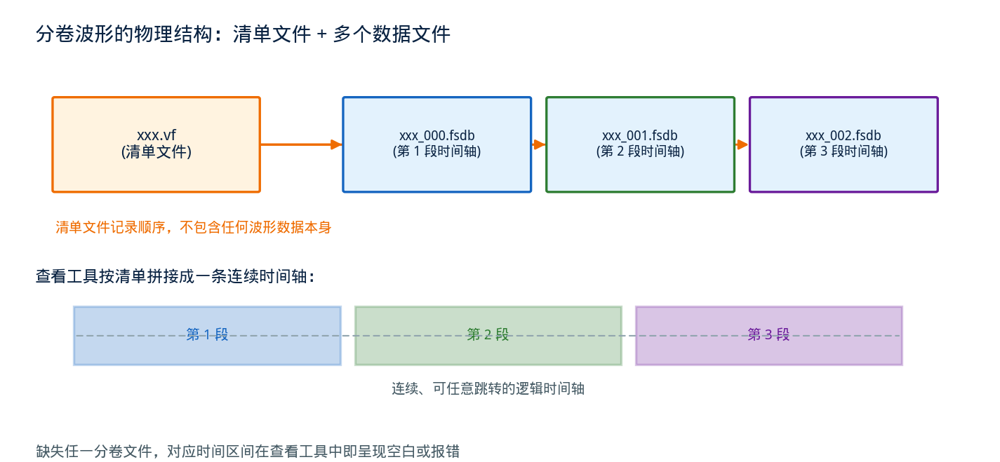
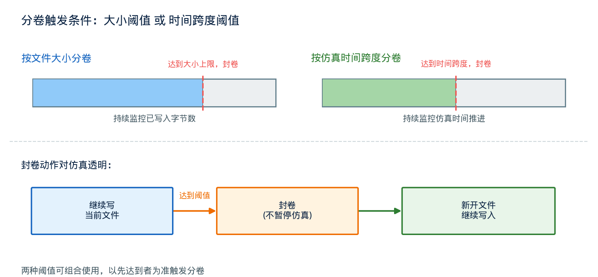

## FSDB 的分卷机制：.vf 文件与那些 _000/_001 波形文件到底是什么关系

---

### 导读

有次想把一次仿真的波形拷给同事复现问题，随手 `cp` 了那个 .fsdb 文件过去，结果对方打开时提示数据不完整、后半段时间轴是空的。查了半天才发现，仿真目录里其实还躺着一个同名的 .vf 文件和另一个带编号后缀的 .fsdb，我漏拷了。这件事让我把 FSDB 的分卷机制认真看了一遍——原来一份"波形"，物理上可能压根不是一个文件。

---

### 一、为什么一个波形会被拆成好几个文件

波形转储本质上是一个持续写入的过程：仿真每往前推进一段时间，转储引擎就把这段时间里发生的信号变化追加写进文件。如果仿真跑得足够久、转储的信号足够多，这个文件会持续增长，理论上没有上限。

但现实中的文件系统和工具都有各自的限制：单个文件大小可能受文件系统本身的上限约束，也可能受备份、传输、拷贝等日常运维操作的实际可行性约束——一个几十甚至上百 GB 的单一文件，无论是网络拷贝还是本地归档，都会变得笨重且容易失败。此外，转储程序自身在写入超大文件时，随着文件增长，某些内部结构（比如索引区）的更新和维护成本也会上升，间接影响转储时的仿真性能。

为了绕开这些限制，波形转储工具提供了**分卷（switch）机制**：当正在写入的文件达到预先设定的大小或者时间跨度阈值，转储引擎不会继续无限增长这一个文件，而是把它"封卷"，另外开一个新的物理文件继续写后续的内容。第一份文件仍然完整、独立、可读，只是它只包含了整个仿真时间轴的一部分；仿真继续运行产生的新数据，被写进第二份、第三份文件，依此类推。

---

### 二、分卷之后，谁来记住"顺序"

分卷解决了单文件体积失控的问题，但立刻带来一个新问题：这些物理上独立的文件，怎么让查看工具知道它们其实是同一次仿真、按什么顺序拼接起来才是完整的时间轴？

答案是一份专门的**清单文件**——通常以 `.vf` 作为扩展名（意思接近"file version"或"virtual file"，具体命名由工具厂商定义），它本身不包含任何波形数据，只记录了这次仿真一共分成了几个物理数据文件、每个文件的文件名以及它们的先后顺序。查看工具打开波形时，实际上是先读这份清单文件，再按清单里记录的顺序，把各个物理数据文件依次拼接成一条逻辑上连续的时间轴呈现给用户——从使用者的视角看，这份被拆分的波形和一份完整的单文件波形没有任何区别，可以在任意时间点自由跳转，仿佛它们本来就是一个文件。

这里有个容易被忽略的细节：**清单文件和它指向的所有分卷数据文件，是一个不可分割的整体**。清单文件里记录的是文件名（通常是相对路径），一旦某个分卷文件缺失，或者路径关系被破坏（比如把清单文件和数据文件分开存放、或者只拷贝了其中一部分），查看工具能打开清单、能看到时间轴的骨架，但缺失部分对应的时间区间就会呈现为空白或者报错——这正是文章开头那次"波形不完整"的根本原因：清单文件在，但它指向的某个分卷文件没有一起拷过去。

---

### 三、分卷阈值：转储引擎什么时候"另起一份"

触发分卷的条件通常由两类阈值控制，具体支持哪些取决于转储工具的实现：**文件大小阈值**和**仿真时间跨度阈值**。

按大小分卷的逻辑很直接：转储引擎持续监控当前文件已经写入的字节数，一旦超过设定的上限（比如若干 GB），就封卷开新文件。这种方式能比较精确地控制单个物理文件的体积，方便后续的拷贝、备份、清理等运维操作按可预期的粒度进行。

按时间跨度分卷则是另一种思路：不管文件涨到多大，只要仿真时间推进到设定的跨度（比如若干个时钟周期或者仿真时间单位），就封卷开新文件。这种方式对于需要"按阶段查看波形"的调试场景更友好——如果调试目标集中在仿真的某个特定阶段，只需要定位并拷贝这个阶段对应的那一份分卷文件，而不必处理整个仿真过程产生的全部数据。

两种阈值也可以组合使用：以先达到者为准触发分卷。无论用哪种策略，分卷的过程对仿真运行本身是透明的——转储引擎在后台完成封卷和开新文件的操作，不需要暂停仿真，也不会丢失分卷瞬间前后的数据。

---

### 四、多机回归下的分卷波形：命名与归档的实际考量

在大规模回归环境里，每个测试用例独立运行、独立产生自己的分卷波形集合，这时命名规则和归档策略就变得重要。

分卷产生的物理文件通常会在原始文件名基础上加一个递增的数字后缀（比如 `_000`、`_001`），而清单文件则保持和原始转储任务同名、只是扩展名不同。这种命名约定的好处是：只要看到一个 `.vf` 文件，就能推断出与它配套的所有分卷文件大概率遵循同一套命名前缀，便于用脚本批量识别和打包。

归档或者跨环境分享波形时，正确的做法是把清单文件和它引用的**全部**分卷文件作为一个整体一起处理——无论是打包压缩、上传到共享存储，还是拷贝到另一台机器，都不能只挑其中一部分。规模较大的回归系统在保存失败用例的调试现场时，通常会有专门的逻辑先解析清单文件、找出所有被引用的分卷文件，再统一归档，避免人工操作时的遗漏。

另一个容易被忽略的点是**磁盘清理**。如果只删除了大的分卷数据文件、却留下了体积很小的清单文件（或者反过来），会造成清单文件指向不存在的数据、或者数据文件虽然还在但没有清单能够正确拼接它们，两种情况都会让这份波形变得不可用。清理脚本如果按文件大小或者修改时间做简单的批量删除，很容易在这里踩坑。

---

### 五、验证工作流中的几个关注点

**拷贝和打包的完整性**：涉及分卷波形的拷贝、打包、上传操作，必须以清单文件为起点解析出完整的文件列表，而不是凭经验或者通配符猜测。构造一次刻意遗漏某个分卷文件的场景，验证下游的查看工具或者自动化脚本能否给出明确的报错提示，而不是静默地展示不完整的波形却不告知用户。

**分卷阈值的合理性**：分卷太频繁会产生大量小文件，增加文件系统层面的管理开销；分卷太少则起不到限制单文件体积的作用。需要结合具体回归环境里典型的仿真规模和存储限制，评估当前设定的阈值是否合适。

**归档策略与清单文件的绑定关系**：自动化归档、清理脚本需要显式地把清单文件和它引用的分卷文件当作一个原子单位来处理，任何独立处理某一个分卷文件而忽略清单文件整体性的逻辑，长期运行后都可能积累出"数据文件在但打不开"的僵尸波形。

**跨环境路径依赖**：清单文件里记录的分卷文件路径关系（尤其是相对路径假设）在跨机器、跨目录结构分享时是否仍然成立，是实际协作中经常被忽视、却直接决定波形能否在对方环境正常打开的细节。

---

### 六、总结

分卷机制解决的是一个很朴素的工程问题：波形数据会随着仿真推进无限增长，而现实世界的文件系统和运维操作都不擅长处理无限增长的单一文件。转储工具的做法是按大小或时间阈值把数据切分成多个独立的物理文件，再用一份轻量的清单文件记录这些分卷之间的顺序关系，让查看工具能够把它们重新拼接成一条连续的逻辑时间轴。理解了清单文件和分卷数据文件是不可分割的整体这一点，日常拷贝、归档、清理波形数据时，就能避免"清单还在、数据丢了"或者反过来的低级错误。

下次看到波形目录里除了 .fsdb 还有一个体积很小的配套文件，不要随手忽略它——它可能就是让这份波形能被完整打开的关键。

---

*本文基于业界主流波形调试工具的分卷转储机制设计资料整理，结合大规模回归环境下的波形归档实践分析。*
