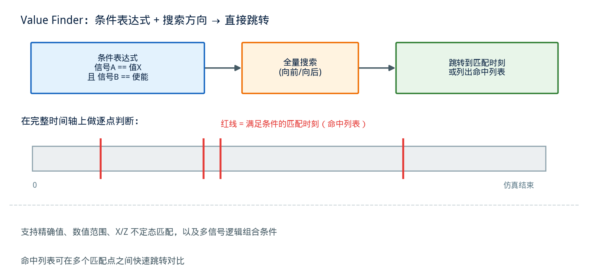
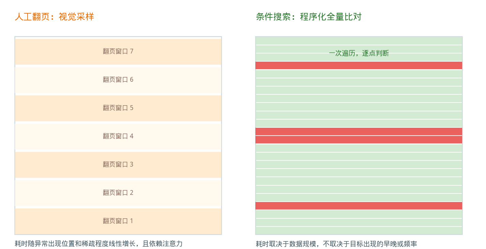

## 波形里的"搜索框"：Value Finder 是怎么帮你跳过人工翻页的

---

### 导读

调一个信号异常问题时，最笨的办法就是打开波形，从头开始一格一格地拖时间轴，盯着某个信号什么时候变成了不该出现的值。有次一个数百万周期的仿真里，某个状态机偶尔会跳进一个非法状态，靠肉眼在波形上找这个时刻，找了快一个小时。后来同事提醒我："这种事交给 Value Finder 就行，几秒钟出结果。"这篇文章就把这个经常被新手忽略的功能讲清楚。

---

### 一、人工翻波形的问题出在哪

波形查看工具本质上是把一份包含成千上万个信号、动辄百万个时间点的数据集，用一条可以缩放、拖动的时间轴呈现出来。这种交互方式对"看一段时间内信号大致如何变化"非常直观，但对"找到某个特定条件第一次成立的那个时刻"却很低效——因为人眼只能在当前视野范围内比对，视野之外的时间区间必须靠不断缩放和拖动才能看到。

如果目标条件出现的频率很低（比如仿真跑了几百万周期，只在其中几个时刻触发一次），靠人工翻页找到它的期望耗时会随着仿真规模线性增长，而且容易漏看——尤其当这个信号变化只维持了一两个时钟周期，缩放比例稍微大一点就会被视觉上"压扁"到看不出来。

这类"在海量时间点里找到满足某个条件的时刻"的需求，本质上是一个搜索问题，而不是一个浏览问题。波形调试工具里的 **Value Finder** 就是专门为这个搜索问题设计的功能。

---

### 二、Value Finder 做的是什么事

Value Finder 的核心逻辑很简单：用户指定一个或多个信号，以及这些信号需要满足的**条件**（可以是某个具体的数值，也可以是数值范围，或者跟 X/Z 这类不定态、高阻态相关的匹配条件），工具在已经转储的整个波形数据中做一次全量搜索，找出所有满足这个条件的时间点，并把光标直接跳转到最近一次匹配的位置。

这个搜索可以指定方向——从当前光标位置向后找下一个匹配点，或者向前找上一个匹配点，也可以直接列出整个仿真过程中所有匹配的时刻，形成一份"命中列表"。有了这份列表，用户可以在多个匹配点之间快速跳转对比，而不需要每次都重新发起一次搜索。

更进一步，Value Finder 通常支持**多信号的逻辑组合**条件——比如同时要求信号 A 等于某个值、且信号 B 不等于另一个值，这类组合条件在实际调试中很常见：很多异常场景不是单一信号达到某个值就能定义的，而是几个信号同时满足特定组合关系时才构成异常。

---

### 三、和"看波形"相比，它到底快在哪

人工翻页的耗时特征，本质上取决于目标时刻在整个仿真时间轴里的位置——如果异常出现得晚，或者出现得稀疏、不规律，翻页耗费的时间会明显增加，而且这个耗时几乎完全依赖人的注意力集中程度，容易漏看。

条件搜索的耗时特征则完全不同：只要条件表达清楚，工具在已转储的数据上做一次遍历匹配，耗时主要取决于数据规模本身，而不取决于目标时刻出现的早晚或者出现的频率。对于一个几百万周期里只出现几次的低频事件，这个差异是数量级的——人工翻页可能要花几十分钟甚至更久，条件搜索通常在几秒到几十秒内就能返回结果。

这个差异背后的原理也很直观：人工翻页是**视觉采样**，任何时候视野里只能看到一段有限的时间窗口，之外的区域完全依赖翻页动作才能看到；条件搜索是**程序化的全量比对**，直接在数据层面上对每一个时间点做条件判断，不受视觉呈现范围的限制。

---

### 四、条件表达的几种典型用法

**精确值匹配**：最基础的用法，比如查找某个状态寄存器第一次变成某个特定编码值的时刻。这类用法适合调试"进入了不该进入的状态"这类问题。

**不定态/高阻态匹配**：查找信号变成 X（不定态）或 Z（高阻态）的时刻。这类匹配在调试初始化时序问题、总线竞争问题时非常关键——很多这类问题的根因就是某个信号在不该出现不定态的窗口里出现了不定态，而这种状态往往转瞬即逝，人工翻页几乎不可能稳定捕捉到。

**数值范围匹配**：查找某个计数器或者地址信号落入某个区间的时刻，用于定位跟特定地址范围、特定数值区间相关的行为。

**多信号组合条件**：前面提到的逻辑组合能力，用于表达"多个条件同时成立"或者"多个条件中至少一个成立"这类复合场景。组合条件越接近异常本身的定义，搜索结果就越精准，减少后续人工筛选命中列表的工作量。

---

### 五、验证工作流中怎么用得更有效

**先把异常定义翻译成条件表达式，再动手搜索**：Value Finder 的效率高度依赖条件本身是否准确表达了要找的现象。花时间把"这个信号偶尔会不对"这种模糊描述精确成"信号 A 等于非法值 X 且信号 B 处于使能状态"这样的具体条件，往往比反复试探更快找到结果。

**结合命中列表做统计性判断，而不只是找第一个点**：很多问题不是只出现一次，列出所有匹配时刻之后，观察这些时刻在仿真时间轴上的分布规律（比如是否集中在某个测试阶段、是否和某个周期性事件对齐），能提供比单个时间点更多的调试线索。

**对稀疏、瞬时性的异常优先使用条件搜索而不是波形缩放**：像单周期的毛刺、瞬时的不定态这类现象，在缩放视图里很容易被压缩到不可见，而条件搜索是对底层数据做逐点判断，不会受视图缩放比例的影响，更适合这类场景。

**大规模回归中把条件搜索脚本化**：如果某类异常条件在多个测试用例的波形里都需要检查，把条件搜索的逻辑写成脚本、批量运行在多份波形文件上，比逐个用交互式工具打开、手动搜索的效率高得多，也更适合作为回归失败根因分析的第一道自动化筛查。

---

### 六、总结

波形调试里最容易被浪费的时间，往往花在"确认某个条件到底在哪个时刻发生"这件事上——如果靠人工翻页，耗时随着仿真规模和异常出现的稀疏程度线性甚至更差地增长。Value Finder 把这个问题从"视觉浏览"转成了"条件搜索"：用一个能精确描述异常特征的表达式，直接在整个转储数据上做一次全量匹配，几秒钟内定位到所有满足条件的时刻。用好它的关键不在工具本身有多智能，而在于能不能把模糊的异常现象翻译成足够精确的条件表达式——这一步做得越准，搜索出来的结果就越有价值。

下次再遇到"这个信号偶尔会跳到不该出现的值"这种问题，先想想能不能写成一个条件，交给 Value Finder，而不是伸手去拖时间轴。

---

*本文基于主流波形调试工具中条件搜索类功能的设计逻辑整理，结合芯片验证调试实践分析。*
