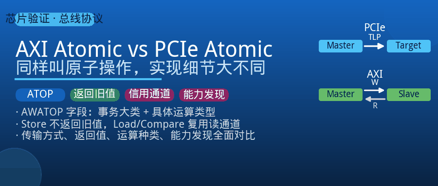
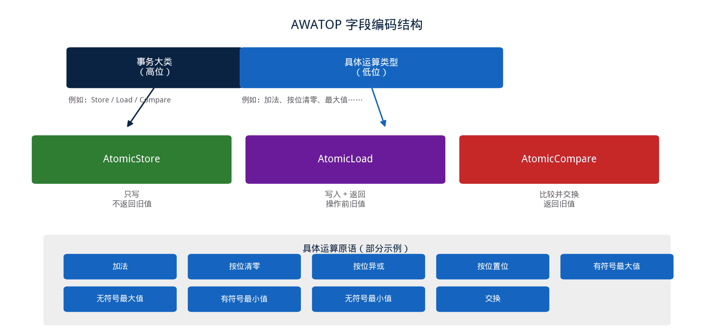
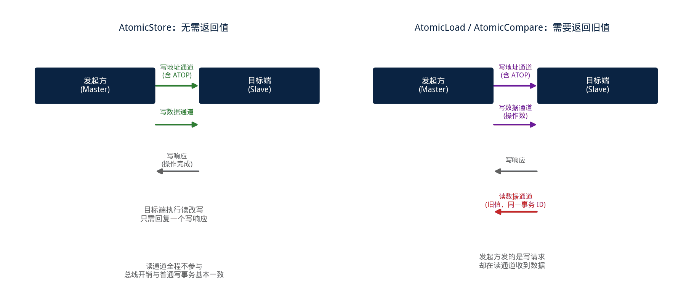
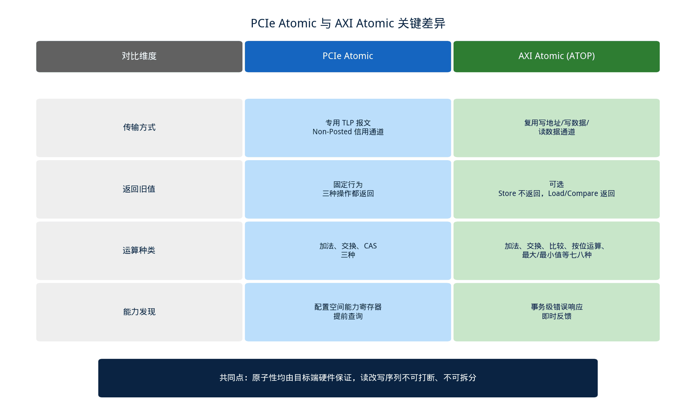

## [AXI] AXI 里也有 Atomic 操作吗？和 PCIe 的 Atomic 有什么不同

---

### 导读

前几天有同事问了一句：写 PCIe 那篇 Atomic 文章的时候，有没有顺便看看 AXI 总线上是不是也有类似的机制？

这一问倒是提醒了我——两个协议确实都定义了"原子操作"，名字听起来一样，解决的核心问题也一样（设备侧无锁读改写），但落地的方式差得不少。这篇文章就把 AXI 里的 Atomic 机制讲清楚，最后和 PCIe 放在一起对比一下。

这里先厘清一个容易混淆的地方：本文说的 AXI Atomic，特指 AXI5 协议里新增的原子事务机制，通常缩写为 ATOP，不是 ACE/CHI 缓存一致性协议里那套用来维护多核缓存一致性的原子操作，两者是不同层面的东西，本文只讨论前者。

---

### 一、AXI 为什么也需要原子操作

AXI 总线连接的主设备（比如 CPU 核心、加速器、DMA 引擎）经常需要对共享内存做读改写，典型场景是维护一个跨设备共享的计数器、信号量，或者做无锁数据结构的更新。

如果没有硬件层面的原子支持，这类操作只能拆成"读一次、改一次、写一次"三个独立的总线事务，中间任何一步都可能被其他主设备的访问插队，读改写序列的完整性就无法保证。这和 PCIe 场景下设备侧无锁访问系统内存的动机完全一致，只是问题发生在片内互联而不是片间互联上。

AXI5 版本的协议规范正式引入了原子事务机制，让发起方可以用一次总线事务，把"读、改、写"这三步打包成一个原子操作交给目标端（通常是内存控制器或者支持原子能力的从设备）去完成。

---

### 二、AXI Atomic 的编码方式：一个字段决定操作类型

AXI 把原子操作的类型信息编码进写地址通道新增的一个字段里，习惯上称为 ATOP。这个字段被拆成两部分：高位表示"事务大类"，低位表示"具体做什么运算"。

**事务大类**分三种：AtomicStore（只写，不要求返回旧值）、AtomicLoad（写入的同时要求返回操作前的旧值）、AtomicCompare（比较并交换）。这个大类划分本身就是 AXI 和 PCIe 的第一个明显差异——PCIe 的三种操作里，返回旧值是隐含在语义里的固定行为，而 AXI 把"要不要返回旧值"做成了显式可选项，发起方可以按需选择更轻量的路径。

**具体运算类型**则更丰富：加法、按位清零、按位异或、按位置位、有符号/无符号的最大值、有符号/无符号的最小值，一共提供了七八种运算原语，覆盖的场景比 PCIe 只有加法和交换（不算 CAS）要广得多。这背后的设计考虑是，AXI 主要服务于片内总线，参与设计的主设备类型多样，图形处理、网络包处理这类场景经常需要"取最大值""按位置位"这类操作来维护状态标志或者统计极值，如果都退化成"读出来、算、写回去"，会浪费大量总线周期。

---

### 三、返回值走哪条通道：Store 与 Load/Compare 的路径差异

AXI 总线本身是分离的读写通道结构：写地址、写数据、写响应是一组，读地址、读数据是另一组。原子操作的请求（地址 + 操作类型 + 操作数）永远走写通道发出去，这一点和运算类型无关。

区别出现在"要不要拿回旧值"这一步。**AtomicStore** 不需要返回值，走完写地址、写数据两步，目标端执行完读改写之后，只需要一个普通的写响应表示"操作完成"，整个过程和一次普通写事务的通道占用几乎一样。

**AtomicLoad 和 AtomicCompare** 因为需要把操作前的旧值带回来，目标端在返回写响应的同时，还会通过读数据通道把旧值传回发起方——用的是同一个事务 ID，方便发起方把这次"意外收到的读数据"和自己发出的那次写请求对应起来。这种"发起方发的是写请求、却在读通道收到数据"的组合，是 AXI Atomic 机制里比较特别的一点，也是初次接触这个特性的人最容易看漏的地方。

这个设计的好处很直接：不需要返回值的场景（比如只是想给某个计数器加一，不关心旧值）可以完全避开读通道的开销，硬件实现和总线带宽都能省一点；需要返回值的场景，则复用已有的读通道基础设施，不必额外定义新的响应类型。

---

### 四、目标端怎么知道自己要不要执行原子操作

发起方只是在总线上声明了"这是一次原子写"，真正的读改写序列必须由目标端硬件在收到请求之后完整执行，中途不能被其他访问打断，这一点和 PCIe 的要求是一致的——原子性的责任始终在目标端，而不是发起方。

不同的是能力声明的方式。并不是所有挂在 AXI 总线上的从设备都支持原子操作，一个从设备如果不具备执行原子运算的能力，规范要求它必须能够识别出这是一次原子请求并给出明确的错误响应，而不是把它当成一次普通写来静默执行——如果目标端把原子请求错误地当成普通写处理，读改写的"改"这一步就会丢失，行为看起来像是数据被覆盖，实际上是能力不匹配导致的静默错误。

这也是为什么原子操作的验证里，"目标端不支持时的错误响应路径"和"目标端支持时的正确执行路径"要同等重视——前者一旦被忽略，问题只会在真正调度到不支持原子能力的从设备时才暴露出来，排查成本很高。

---

### 五、和 PCIe Atomic 放在一起看：核心思路相同，实现细节不同

把两边放在一起比较，会发现它们在解决"设备侧无锁读改写"这同一个问题上，做出的具体选择有几处明显不同。

**传输方式不同**。PCIe 是包交换协议，原子操作被封装成专门的 TLP 报文，经由 Non-Posted 信用通道送到目标端，走的是和普通读写请求相似但独立编号的报文类型；AXI 是基于专用信号通道的总线协议，原子操作复用已有的写地址、写数据、读数据通道，只是在写地址通道里多用一个字段表达"这是原子操作、做什么运算"。

**返回值的处理方式不同**。PCIe 的三种基础原子操作在语义上都要求返回操作前的旧值，属于协议规定的固定行为；AXI 把"要不要返回旧值"做成了显式可选的两条路径，不需要旧值的场景可以走更轻量的 AtomicStore，减少总线开销。

**支持的运算种类不同**。PCIe 只定义了取回并加、交换、比较并交换三种；AXI 除了加法、交换、比较，还额外提供了按位运算和取最大/最小值，运算原语的覆盖面更广，这和两者面向的主设备类型、典型应用场景不同有关。

**能力发现的方式不同**。PCIe 设备通过配置空间的能力寄存器声明自己是否支持原子操作，发起方需要提前查询链路上各级组件是否都支持，才能放心发出请求；AXI 从设备如果不支持原子能力，是在收到请求的当下才通过错误响应告知发起方，属于事务时刻的即时反馈，而不是提前查询。

**共同点也很明确**：无论哪种协议，原子性的实现主体都是目标端硬件，都要求整个读改写序列不可被打断、不可拆分，都是把原本需要软件加锁才能保证的语义，下沉到硬件里用更小的粒度去实现。理解了这个共同的设计初衷，再看两边具体的字段编码和通道选择上的差异，会发现都是各自协议既有基础设施上做的自然延伸，而不是凭空发明的新机制。

---

### 六、验证中容易被忽略的几个点

**Store 与 Load/Compare 的通道占用要分别验证**：AtomicStore 不产生读通道流量，AtomicLoad/Compare 会产生读通道流量且和发起方的写事务共用同一个事务 ID，验证时需要确认读数据的返回时序和到达顺序与规范一致，尤其是在多个原子事务并发在途的场景下，事务 ID 的匹配关系不能出错。

**运算类型的正确性要逐一覆盖**：加法之外，按位清零、按位异或、按位置位、有符号/无符号最大最小值，每一种运算的边界情况（比如操作数为全 0、全 1、符号位翻转）都要单独构造用例，不能只测加法就认为整个机制已经覆盖。

**旧值返回的时机与正确性**：AtomicLoad/Compare 返回的必须是"目标端执行原子运算之前"的值，验证时同样需要在发起请求前记录目标地址当前值，和读通道返回的数据做比对，这一点和 PCIe Atomic 的验证思路是相通的。

**目标端不支持原子操作时的错误路径**：确认不支持原子能力的从设备，收到原子请求时会给出明确的错误响应，而不是把操作数当成普通写数据直接写入，静默执行是这类问题里最难被发现、也最容易被遗漏测试的一条路径。

**跨越对齐边界的原子请求**：和 PCIe 一样，原子操作数需要满足自然对齐要求，验证时需要构造刚好不对齐的地址、以及跨越突发边界的场景，确认实现按规范要求处理（通常是报错或者由更上层逻辑保证不会发生，具体取决于目标端设计约定）。

---

### 七、总结

PCIe 和 AXI 都在协议层面定义了原子操作，出发点完全一致：把设备侧的读改写序列变成硬件保证的不可分割单元，让软件不再需要自旋锁就能安全地共享一块内存。

两者的差异集中在实现细节上——PCIe 用专门的 TLP 报文承载原子请求，固定返回旧值，运算种类偏少，能力通过配置空间提前发现；AXI 复用已有的写通道和读通道，把"要不要返回旧值"做成可选项，运算种类更丰富，能力是否支持通过事务级的错误响应即时反馈。

搞清楚这些差异，再遇到跨协议桥接（比如 PCIe 设备通过某种互联结构访问 AXI 域内存）这类场景时，就能更容易判断原子语义在两种协议之间转换时，哪些属性必须保留、哪些属性需要做适配。

---

*本文基于 AMBA AXI 协议规范中原子事务相关章节，以及 PCIe Base Specification 中 Atomic 相关章节整理对比，结合验证实践分析。*
