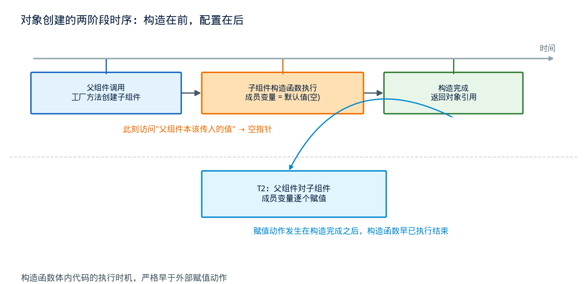
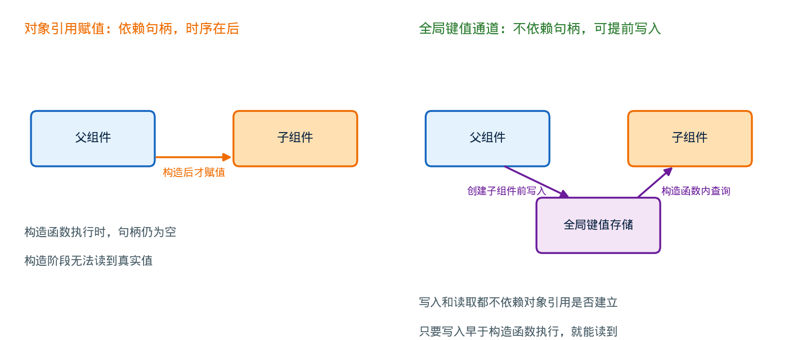

## UVM 组件构造的时序陷阱：为什么 new() 里看不到父组件传下来的配置

---

### 导读

有次同事想根据接口是只读还是只写，有条件地创建覆盖率组——只写接口就不建读覆盖率，省得报告里躺着一堆永远打不中的 0%。逻辑听起来很简单：在组件构造函数里判断一下父组件传来的模式字段，符合条件就 new 一个 covergroup。结果一运行直接空指针报错，改成先判空又变成条件恒为假、覆盖率组该建的全建了，等于没做过滤。这背后其实是一个很基础、却经常被忽略的时序问题：**对象的构造和配置，在 SystemVerilog 里是两件先后发生的事**。

---

### 一、构造和配置，是两个不同的时间点

在面向对象语言里，创建一个对象通常包含两件事：**分配内存、初始化默认值**（构造），以及**把外部数据填进去**（配置）。很多语言把这两件事捏合得很紧，容易让人误以为它们是同一时刻发生的。但在 SystemVerilog 里，这两个阶段有明确的先后顺序，而且中间是可以插入其他代码的。

`new()` 函数只负责构造：它分配对象的内存，把所有成员变量设成默认值——数值类型是 0，句柄（引用类型）是空。构造函数执行完、返回对象引用之后，创建者才会拿到这个引用，接下来才轮到"配置"这一步：调用者用点操作符逐个给对象的成员变量赋值。

这中间有一个很容易被忽略的事实：**构造函数体内的代码，执行时机严格早于配置阶段**。也就是说，如果构造函数内部试图访问某个"本该由父组件传进来"的成员变量，这个变量在那一刻还是默认值——对于句柄类型，默认值是空。访问空句柄的成员，会直接触发运行时错误。

---

### 二、一个具体的时序图：为什么会踩到空指针

把父子组件的创建过程摊开看，时序大致是这样：父组件先调用某种工厂方法创建子组件，工厂方法内部做的事情是分配内存、调用子组件的构造函数、构造函数执行完毕后把对象引用返回给父组件。**父组件对子组件成员变量的赋值，是在工厂方法返回之后才发生的**——这一步在时间线上，稳稳地排在构造函数执行完之后。

这意味着，如果子组件的构造函数体内写了这样的逻辑："检查父组件传进来的某个配置句柄是否满足某个条件，满足就创建某个对象"，这个检查在构造阶段执行时，那个配置句柄必然还是空的——因为父组件还没来得及给它赋值。

这不是一个"偶尔出现的 bug"，而是语言层面的确定性行为：只要遵循"先构造、再赋值"这个标准流程，构造函数内部永远拿不到外部稍后才会赋的值。理解了这一点，前面提到的两种失败尝试就都能解释清楚了：直接访问空句柄的成员触发运行时错误，是因为对空对象解引用；加上判空保护后条件恒为假，是因为判空之后的逻辑分支被空值本身"劫持"成了固定的默认路径，而不是根据真实配置做出的判断——表面上程序不再崩溃，但过滤逻辑事实上从未生效。

---

### 三、绕开时序限制的思路：把数据放进一个不依赖对象引用的通道

问题的本质是：构造函数执行的那一刻，父组件通过对象引用赋值这条路径还没来得及把数据传过来。要解决这个问题，思路只有一个——**换一条不依赖对象引用、时间上更早生效的数据通道**。

验证框架里通常提供一种全局的键值配置机制：调用者可以在任意时间点，把一个值以"路径 + 字段名"为键，写进一个全局可查询的存储里；任何组件只要知道对应的路径和字段名，就可以在自己生命周期的任意阶段查询这个值，包括在自己的构造函数里查询。

这条通道之所以能绕开前面提到的时序问题，关键在于它把"写入配置"和"对象引用是否已经建立"这两件事解耦了。父组件完全可以在**创建子组件之前**，就把这份配置写进全局存储；子组件在构造函数里查询这份存储时，查的是一个独立于对象引用关系的全局表，而不是等待某个句柄被赋值——只要父组件的写入动作发生在子组件的构造函数执行之前，子组件就一定能查到。

这也是为什么这类全局配置机制在验证框架里会被反复强调："构造阶段需要用到的配置，必须通过它来传，不能指望对象引用赋值"——因为对象引用赋值这条路径，在时序上从设计层面就注定晚于构造函数的执行。

---

### 四、正确的写入与读取顺序

用好这条全局配置通道，有一个容易被忽视但决定成败的细节：**写入操作必须发生在子组件被创建之前**。如果父组件先创建了子组件、再写入配置，那么子组件构造函数里的查询同样会扑空——因为查询这一步执行的时候，那份配置还没有被写进去。这和"先赋值给成员变量、后调用构造函数没有意义"是同一个道理：全局配置通道解决的是"通道本身"的问题，而不是自动帮你调整代码的先后顺序，先写后读这个基本约束依然需要开发者自己保证。

另一个容易出错的地方是**路径和名称的匹配**。这类全局配置通常按"上下文 + 实例路径 + 字段名"这样的层级结构组织，写入时用的路径和读取时用的路径必须能够对应上——如果父组件在写入时用的实例名称，和实际创建子组件时使用的名称不一致，读取时会查询失败，而这类失败通常不会主动报错，只会静默地退回默认值，容易让人误以为逻辑生效了，实际上从头到尾都没有真正读到配置。

---

### 五、另一种思路：把决策延后到配置完成之后

除了引入全局配置通道，还有一种更直接的思路：既然构造阶段读不到配置，那就不要在构造阶段做决策——把需要依赖父组件配置的逻辑，挪到生命周期里晚于"配置阶段"的某个环节去执行。大多数验证框架都会把组件的生命周期划分成若干个阶段，构造只是最早的一个，后面还有专门用于建立层次结构、连接组件之间引用关系的阶段。如果把"检查配置、决定要不要创建某个子对象"这件事挪到这些更靠后的阶段，此时父组件的赋值早已完成，读取到的自然是真实值。

这个思路和全局配置通道相比，各有取舍：延后决策不需要额外的键值存储机制，逻辑直观，但它要求被延后创建的对象本身不依赖"必须在构造阶段就存在"这个前提——如果某些自动化机制（比如自动发现、自动统计）依赖对象在构造阶段就已经创建完毕，那么延后创建就会破坏这些机制的假设，这时候全局配置通道仍然是更稳妥的选择。两种思路没有绝对的优劣，取决于被创建对象本身对"创建时机"是否敏感。

---

### 六、验证中的几个关注点

**构造函数体内对引用类型成员的访问，一律先假设它是空的**：写代码时养成习惯，任何在构造函数里出现的、指向父组件配置的句柄，都要假设此刻它还没有被赋值。真正需要在构造阶段拿到的数据，走全局配置通道；不那么紧急的，挪到后续阶段读取。

**判空保护不等于逻辑正确**：加上判空之后代码不再崩溃，但如果判空之后的分支恰好是"默认创建"或者"默认跳过"，很容易掩盖真正的问题——程序表现得"正常运行"，但业务逻辑其实从未按预期生效。这类问题在测试覆盖不充分、又缺乏日志佐证的场景下特别容易被长期忽略。

**全局配置通道的写入时机和路径匹配需要显式检查**：调试这类问题时，第一步永远是确认"写入动作是否真的发生在创建动作之前"，第二步是确认"写入和读取用的路径、字段名是否完全一致"。多数框架在查询失败时会静默返回默认值而不报错，这个"静默失败"的特性使得路径不匹配的问题格外难以在第一时间被发现，建议在读取配置失败时主动打印警告日志，而不是无声无息地退回默认值。

**覆盖率对象的创建时机会影响统计工具的展示行为**：如果覆盖率相关对象依赖某些自动发现机制，在选择"全局配置通道"还是"延后到后续阶段创建"这两种方案时，需要提前确认目标工具对创建时机是否敏感，避免方案本身可行、却在统计报告环节出现意外的展示差异。

---

### 七、总结

这个问题的根源，从头到尾只有一句话：**构造在前，配置在后，二者之间没有语言层面的自动衔接**。任何试图在构造函数里读取"本该由外部稍后传入"的数据，都会撞上这堵时序墙。解决办法要么是换一条不依赖对象引用、可以提前写入的全局通道，要么是把依赖这份数据的逻辑挪到生命周期中更靠后、配置已经完成的阶段。两种办法本质上都是同一个原则的不同实现:**只在数据确定已经就绪的时间点，才去读取它**。理解了这一层时序关系，类似的空指针问题、逻辑恒定不生效的问题，往后都能一眼看出症结所在，而不必每次都靠报错信息倒推半天。

---

*本文基于 SystemVerilog 面向对象模型中构造与配置分离的机制，以及主流验证框架全局配置通道的设计逻辑整理，结合验证实践分析。*
