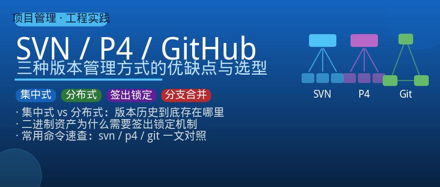
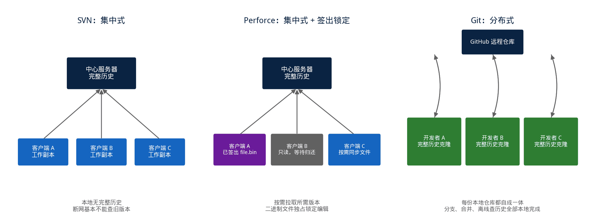
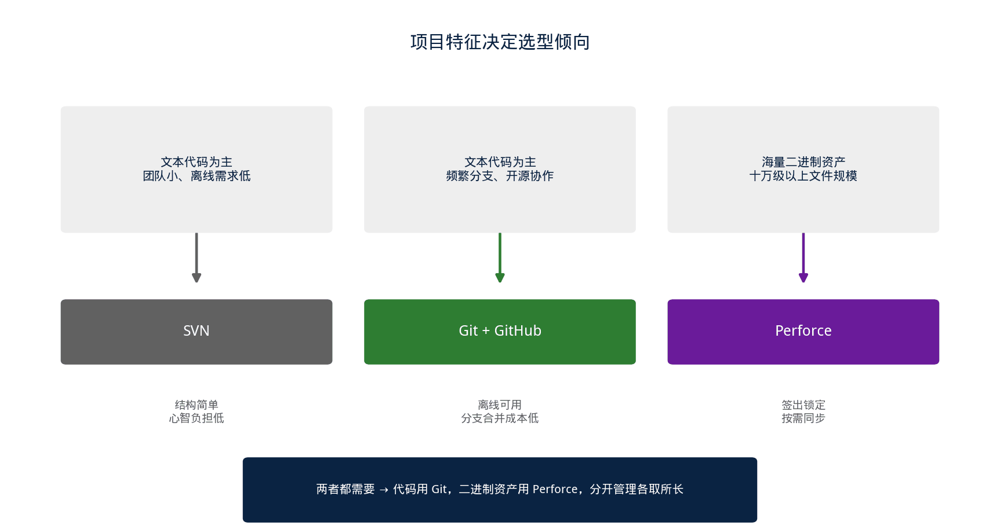

## [DV_FLOW] 版本管理这条路：SVN、Perforce、Git 到底该怎么选

---

### 导读

前阵子带一个刚转岗过来的同事熟悉项目环境，他问了一句很实在的问题："我们组用 Perforce，隔壁组用 Git，学校里教的是 SVN，这三个东西到底有什么本质区别，为什么不统一用一个？"

这个问题看似简单，但认真想清楚背后的设计取舍，其实能帮我们更好地理解"版本管理"这件事到底在解决什么问题。这篇文章想把这三种工具放在一起，聊聊它们各自的设计出发点、在项目管理上的优缺点，最后整理一份常用命令速查。

---

### 一、版本管理要解决的核心问题

抛开具体工具，版本管理系统本质上要回答三个问题：**谁在什么时候改了什么、怎么把多个人的修改安全地合到一起、出了问题怎么退回到之前的某个状态**。

听起来简单，但一旦团队规模变大、文件数量变多、修改变得频繁，这三件事任何一件处理不好，都会变成日常开发里持续的痛点——文件被覆盖、修改互相冲突、想找回三周前的版本却无从下手。

SVN、Perforce、Git 这三个工具，本质上是在同一个问题上给出了三种不同时代、不同设计哲学的答案。理解它们的差异，关键不在于记住命令怎么打，而在于理解每种工具背后"版本库应该长什么样"的核心设定。

---

### 二、SVN：一个中心仓库，所有人对着它工作

SVN（Subversion）代表的是最经典的**集中式版本管理**思路：整个项目只有一份权威的版本历史，存放在服务器上。

每个开发者本地只保留"当前签出的这一份工作副本"，没有完整的历史记录。提交修改时，客户端直接把变更发送到服务器，服务器上的版本号立即往前推进一位。

这种设计的好处非常直接：**结构简单，心智负担低**。团队里所有人看到的版本号是同一套递增序列，"当前版本是多少"这个问题永远只有一个答案，不存在"我这边的历史和你那边的历史长得不一样"的情况。对于目录、空文件、权限这类元数据的版本控制，SVN 也做得比较到位，这在早期很多企业级项目里是刚需。

但集中式模型的代价也很明显。**离开网络，本地几乎什么都做不了**——想查一下上周的某次提交改了哪些内容，如果连不上服务器，答案就是查不到，因为完整历史压根不在本地。

分支和合并的体验也比较粗糙：SVN 的分支本质上是在版本库里复制一份目录树，随着分支存在的时间变长、主干持续演进，合并回去的冲突会越滚越大，这也是很多团队后来放弃 SVN 的直接原因。

---

### 三、Perforce（P4）：为海量二进制资产量身定制的中心化方案

Perforce 同样是中心化架构——这一点和 SVN 相似，全局版本号统一递增，服务器是唯一的权威历史来源。

但它的设计目标和 SVN 有本质区别：**SVN 主要为文本代码设计，Perforce 从一开始就是为海量文件、尤其是海量二进制文件（游戏美术资产、芯片设计中的仿真波形、网表、IP 库文件等）设计的**。

这个设计目标带来了两个关键的工程决策。第一是**签出锁定（checkout lock）机制**：对于无法进行文本合并的二进制文件，Perforce 允许（也建议）在编辑前显式签出，签出期间其他人可以看到"这个文件正被谁独占编辑"，从根本上避免了两个人同时改同一份二进制文件、谁的修改都无法合并的尴尬局面。

第二是**极致的大规模文件性能**：Perforce 服务器只把每个文件"当前需要的那个版本"同步到本地，而不是像分布式系统那样把整个仓库的完整历史都克隆一份，这在文件数量以十万、百万计的项目里是决定性优势——芯片验证项目动辄几十万个用例文件、日志和波形，全量克隆的方案根本无法承受。

代价同样存在：Perforce 是商业软件，需要付费授权和专门的服务器运维；离线工作能力比 Git 弱，日常操作高度依赖和服务器的连接。

对于纯文本代码协作、频繁分支实验这类场景，它的分支模型（基于文件路径映射的 branch spec）比 Git 的分支重得多，创建和切换分支不像 Git 那样轻量随意。

---

### 四、Git / GitHub：把完整历史装进每个人的电脑

Git 代表的是完全不同的**分布式版本管理**思路：每个开发者克隆下来的不是"当前这一份文件"，而是**项目从第一次提交到最新一次提交的完整历史**。

这意味着本地仓库本身就是一份完整、独立、可用的版本库，不依赖任何网络连接就能查历史、切分支、做提交、看某次改动的具体差异。

这个设计带来的最大红利是**分支和合并的成本被大幅降低**。在 Git 里创建一个分支只是在本地记一个指针，几乎没有额外开销；多个分支并行开发、频繁地相互合并，是 Git 工作流里默认的常态，而不是需要谨慎评估才敢做的重大操作。

GitHub 在 Git 之上叠加的 Pull Request（合并请求）机制，把"代码评审"变成了合并流程里自带的一环——修改必须先经过评审、讨论、CI 检查，才能合并进主干，这对代码质量的把控是结构性的，而不是靠人自觉。

分布式模型也有它天然的短板。**每个人本地都保存了完整历史，仓库体积会随着历史积累持续膨胀**，对于包含大量二进制文件、又需要长期保留完整历史的项目（比如动辄几十 GB 的仿真波形库），克隆一份完整仓库的时间和磁盘开销可能变得不现实。

虽然后续出现了 LFS（大文件存储）之类的扩展方案来缓解这个问题，但终究是打了补丁，不像 Perforce 那样天生为这个场景设计。另外，Git 的历史一旦形成，本质上不太欢迎"部分获取"——虽然有浅克隆、稀疏检出等手段，但这些都是为了适配大仓库而后加的功能，不是默认的使用体验。

---

### 五、放在一起看：该怎么选

把三者放在一起比较，会发现选择的关键其实不是"哪个工具更先进"，而是**项目的文件特征和团队协作模式**。

如果项目以文本代码为主，团队规模不大，历史查阅和离线工作的需求不迫切，SVN 的低心智负担仍然有它的市场——不过近些年新立项的项目选择 SVN 的确实已经越来越少，因为 Git 在文本协作上的体验全面超越它，转换成本又不算太高。

如果项目里有大量无法做文本合并的二进制资产，且这些资产的规模会持续增长到十万、百万级文件，签出锁定机制和按需同步能力就变得不可替代——这也是为什么芯片设计、游戏开发这类重资产型项目至今仍然大量使用 Perforce。

如果项目以代码协作为核心，团队需要频繁地并行开发、分支实验、开源协作，Git 配合 GitHub 的评审流程几乎是目前的默认答案——离线可用、分支成本低、生态工具丰富，这几项叠加起来的效率提升，在纯代码场景下很难被前两者追上。

实际工程里也不是非此即彼：不少大型项目会把代码放在 Git 里、把海量二进制资产放在 Perforce 里分开管理，各自发挥所长，只是要多维护一套"两边如何对应"的约定，增加了一点协作复杂度，换来的是两边都能用最合适的方式管理各自的内容。

---

### 六、常用命令速查

**SVN 常用命令**：从服务器签出一份完整的工作副本到本地：

**`svn checkout <url>`**

把服务器上的最新修改同步到本地工作副本：

**`svn update`**

把本地修改提交到服务器，版本号立即递增：

**`svn commit -m "说明"`**

查看本地哪些文件被修改、新增或删除：

**`svn status`**

查看本地修改和服务器版本之间的具体差异：

**`svn diff`**

查看某个文件或目录的提交历史：

**`svn log`**

撤销本地尚未提交的修改，恢复成服务器上的版本：

**`svn revert <文件>`**

**Perforce（P4）常用命令**：把本地工作区同步到服务器最新版本，相当于 SVN 的 `update`：

**`p4 sync`**

在修改前显式签出文件，标记"我正在改这个"：

**`p4 edit <文件>`**

把新文件加入版本库跟踪：

**`p4 add <文件>`**

把签出并修改过的文件提交到服务器：

**`p4 submit`**

放弃本地修改，取消签出状态：

**`p4 revert <文件>`**

查看已签出文件相对服务器版本的差异：

**`p4 diff`**

查看当前自己签出了哪些文件，避免提交时漏改或者忘记归还签出状态：

**`p4 opened`**

**Git 常用命令**：把远程仓库的完整历史克隆到本地：

**`git clone <url>`**

查看当前工作区的修改状态：

**`git status`**

把修改加入暂存区，准备提交：

**`git add <文件>`**

把暂存区内容提交为一次本地历史记录：

**`git commit -m "说明"`**

把本地提交推送到远程仓库：

**`git push origin <分支名>`**

拉取远程最新提交并与本地合并：

**`git pull`**

创建新分支：

**`git branch <分支名>`**

切换分支：

**`git checkout <分支名>`**（或 `git switch <分支名>`）

把指定分支的修改合并到当前分支：

**`git merge <分支名>`**

查看提交历史：

**`git log`**

查看尚未提交的具体修改内容：

**`git diff`**

---

### 七、几个实用建议

**二进制文件多的项目，优先考虑 Perforce 或者 Git LFS**，不要用 Git 的默认方式直接管理会频繁变化的大文件——每次修改都会让仓库体积再增加一份完整拷贝，长期下来克隆和同步都会变得越来越慢。

**分支策略要和工具特性匹配**：Git 分支几乎零成本，适合鼓励频繁开分支、小步提交、快速合并；Perforce 的 branch spec 相对更重，更适合"长期存在的少数几条主干线"这种模式，不要照搬 Git 那种"一个小需求就开一个分支"的习惯，否则维护成本会明显上升。

**提交信息认真写，任何工具都一样**：无论是 `svn commit`、`p4 submit` 还是 `git commit`，提交信息决定了几个月后的自己或者同事能不能快速理解"这次改动是为了解决什么问题"，这一点和用什么工具无关，是版本管理这件事本身最容易被忽视、却最有长期价值的习惯。

**签出/锁定机制不是摆设**：在 Perforce 这类支持签出锁定的系统里，改二进制文件前一定记得先用 `p4 edit` 签出，改完及时用 `submit` 归还签出状态；长时间占着签出不提交，会让同事的修改被迫排队等待，这在协作频繁的项目里是很容易引发摩擦的细节。

---

### 总结

SVN、Perforce、Git 这三者的本质区别，归根结底是**版本历史存放在哪里、以及围绕这个存放位置演化出的一整套协作方式**。

SVN 把完整历史留在中心服务器，换来结构简单但离线能力弱；Perforce 同样中心化，但针对海量二进制资产做了签出锁定和按需同步的专门优化；Git 把完整历史分发到每个人手里，换来离线可用和低成本分支，代价是仓库会随着历史增长而变得沉重。

选型时不必纠结"哪个更先进"，而是回到项目本身的文件特征和协作模式——文本代码为主、追求协作效率，选 Git；二进制资产为主、追求规模化管理，选 Perforce；两者都需要，也可以分开管理各取所长。

搞清楚这层设计逻辑，遇到新项目该选什么、老项目要不要迁移，心里就有一杆比"随大流"更靠谱的秤。

---

*本文基于三种版本管理系统的公开设计文档与业界通用实践整理，具体命令参数以所在团队使用的工具版本为准。*
